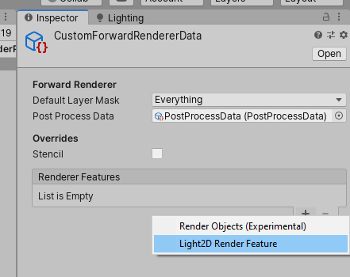

# Unity 2D Lighting System

An implement of 2D lighting system in Unity.

## Development Environment

- Unity 2019.3.0f

## Dependencies

- Unity Universal Render Pipeline (URP)

## Features

- Implement with CommandBuffer.
- Support Universal Render Pipeline
- 2D textured light & procedural light.
- 2D soft shadows.
- Support DX, OpenGL, Vulkan & OpenES 3.0

## Usage

See `/Assets/2D Lighting/Demo/SampleScene` for example

Simply put `/Assets/2D Lighting` folder into your project.

### With Built-in Render Pipeline

Use branch `built-in-pipeline` to avoid compiling errors with missing dependencies.

### With Universal Render Pipeline

1. Create a `UniversalRenderPipelineAsset` with `Assets > Create > Rendering > Universal Render Pipeline > Pipeline Asset`

2. Create a Renderer with `Assets > Create > Rendering > Universal Render Pipeline > Forward Renderer`

3. Create a Light2D Render Feature in Inspector

4. Assign this Renderer to the `UniversalRenderPipelineAsset` created before